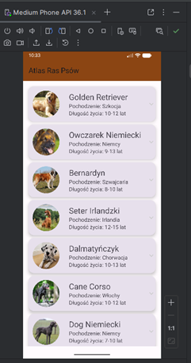
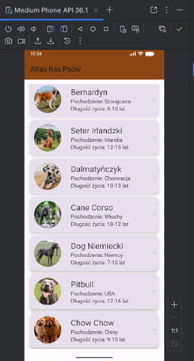
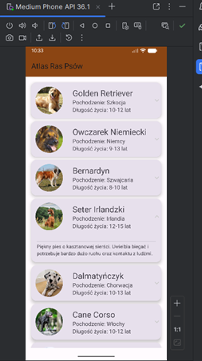
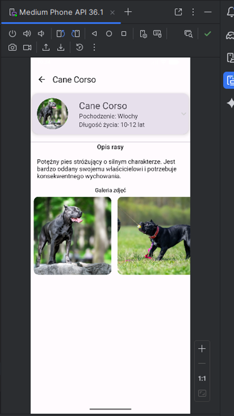

**DogApp - Atlas Ras Psów**
*Prosta aplikacja mobilna na system Android, służąca do przeglądania listy ras psów. Projekt został wykonany w celu przećwiczenia architektury Model-Widok-Kontroler (MVC) oraz nowoczesnego budowania interfejsu w Jetpack Compose.*

**O aplikacji**
Aplikacja wyświetla dynamiczną listę ras psów. Użytkownik może przeglądać listę, a po kliknięciu w konkretną pozycję, system rejestruje to zdarzenie.

**Kluczowe funkcjonalności i technologie:**
Architektura MVC: Rozdzielenie danych od logiki interfejsu.
Komponent Scaffold: Wykorzystanie systemowego szkieletu dla paska górnego (TopBar) i dolnego (BottomBar).
LazyColumn: Wydajne wyświetlanie przewijanej listy elementów.
Nawigacja: Przygotowany system przechodzenia między ekranem głównym a szczegółami (MovieNavigation).
Material Design 3: Obsługa motywów kolorystycznych oraz nowoczesnych komponentów UI.

**Diagnostyka i "Sensory":**
Choć aplikacja nie korzysta z czujników fizycznych (jak żyroskop), wykorzystuje zaawansowane mechanizmy śledzenia:
Obsługa zdarzeń dotyku: Programowanie reakcji na kliknięcie w element listy.
Logcat (Diagnostic Tool): Wykorzystanie Log.d do monitorowania przepływu danych i logowania wybranych ras w czasie rzeczywistym.

**Widok aplikacji**

    

**Instrukcja uruchomienia:**
1. Sklonuj repozytorium:
   `git clone https://github.com/weitina/DogApp.git`
2. Otwórz projekt w *Android Studio*.
3. Poczekaj na synchronizację plików *Gradle*.
4. Uruchom aplikację na emulatorze lub fizycznym smartfonie z Androidem (min. API 24).
5. Otwórz zakładkę *Logcat* w Android Studio i przefiltruj po tagu `TAG`, aby zobaczyć logowanie wybranych filmów.
